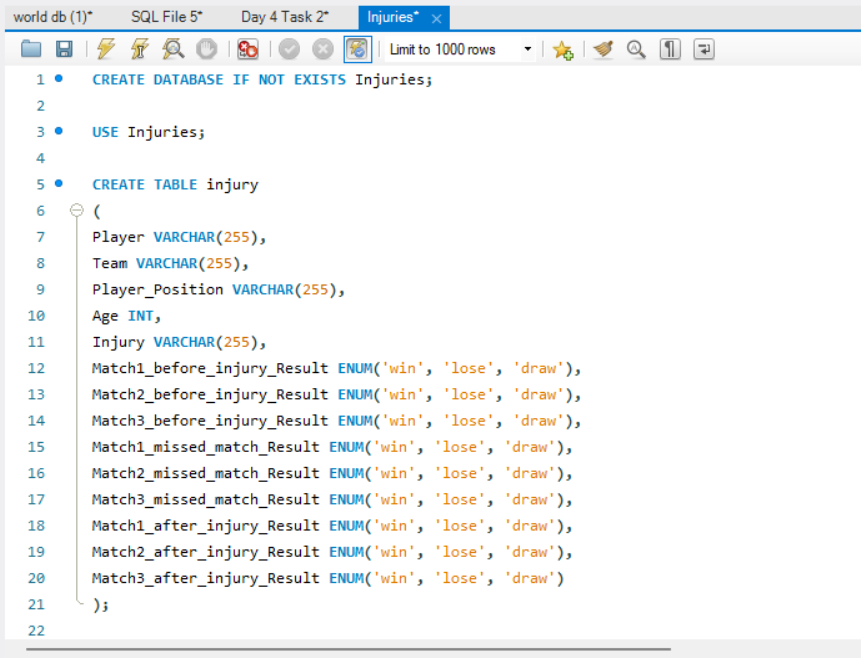
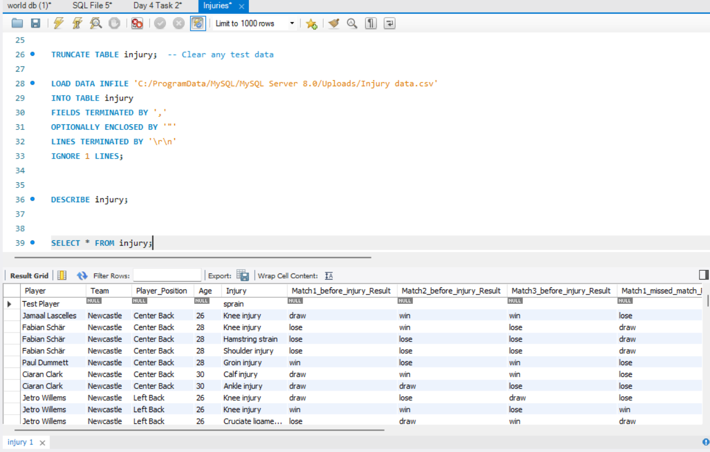
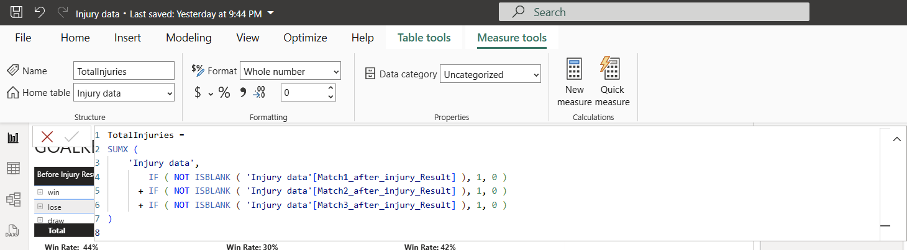

# Injury-Data
Football injuries and the match results before and following player injury.

I will be looking at 657 records of player Injuries for the English Premier League

I want to see if the typical value of a players position matches their actual impact shown by result data before, during and after injury.

For example my hypothesis is Forwards are overvalued and Goalkeepers are undervalued. My expectation is results will have more losses when Goalkeepers are injured than Forwards.

## Creating Database in SQL

## Loading data in SQL

## Using measures to count all win, loss and draw data

